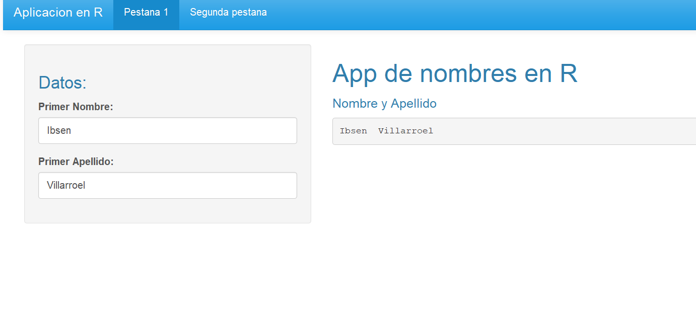
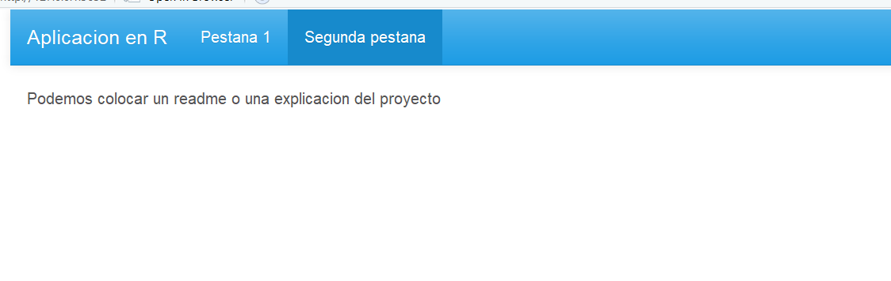

#Aplicacion que une nombre y apellido al momento en R

Esta aplixacion nos retorna de manera automatica el nombre y el apellido de una persona una vez que esta los escribe en los textbox, sin tener que hacer click en el boton de submit

Adicionalmente podemos crear otras pestañas y agregar informacion del proyecto

